 

###

  

###

###

 

###

<h3 align="left">🇧🇷/🇺🇸Eu Progamo Por Hobby(Futuralmente Trabalho) com: / I program as a hobby (in the future a job) With: </h3>

###

  
  
  
  
  

###

<h4 align="left">🇧🇷/🇺🇸Minhas Redes Sociais: / My Social Medias:</h4>

###

  
  

###

<picture>
  
</picture>

###
